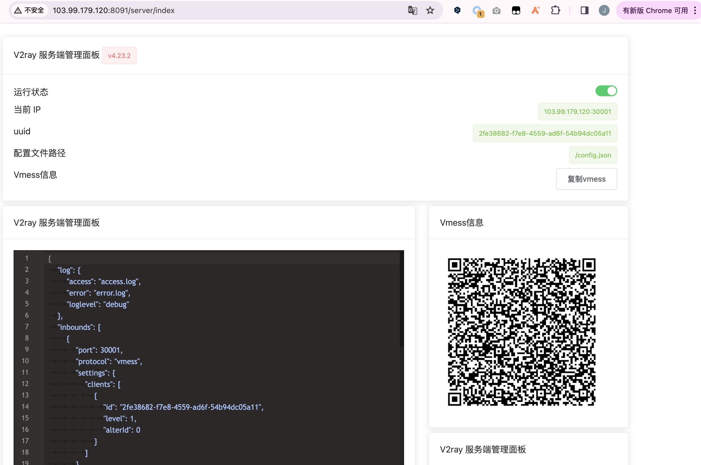
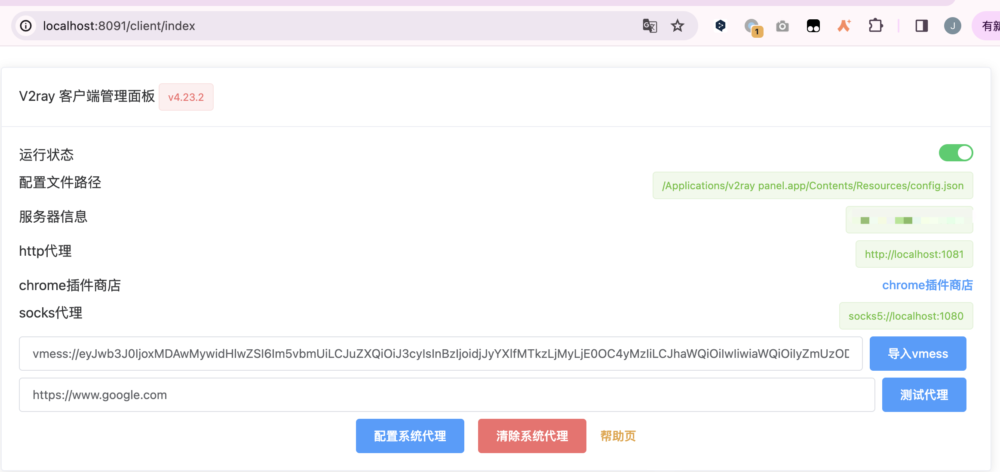

### v2ray panel 

基于 v2ray-core  v4.23.2 实现了 简单部署的服务端+(win/mac/linux)可视化客户端
服务端界面如下: 



客户端截图: 




### 服务端使用方式:

1. 下载 linux 安装包,

2. 执行:

```shell
./scripts/install_service.sh
```

3. 启动:

```shell
systemctl start v2ray-panel
```

4. 打开web端口, 初始化默认配置、可以修改uuid、端口 保存配置，导出 `vmess` 链接.
```js
http://ip:8091
账号: admin
密码: admin123
```

5. 点击测试代理状态可以查看是否成功代理


### 客户端使用方式.

1. mac/win 都是解压直接运行，windows的配置文件在当前文件夹内，不建议直接修改config.json.

2. 打开以后会自动启动代理、跳转到管理界面并且后台运行.

3. 如果代理未配置成功会自动失败，不影响，在web界面黏贴 `vmess` 链接即可导入配置，

4. 可以自行修改配置、初始化配置、测试代理状态等.

####  ios安装oneclick 可以免费使用
请参考：[https://www.oneclick.earth/#/](https://www.oneclick.earth/#/)

#### android 待测试 (ps: 手头上没有安卓机器)


